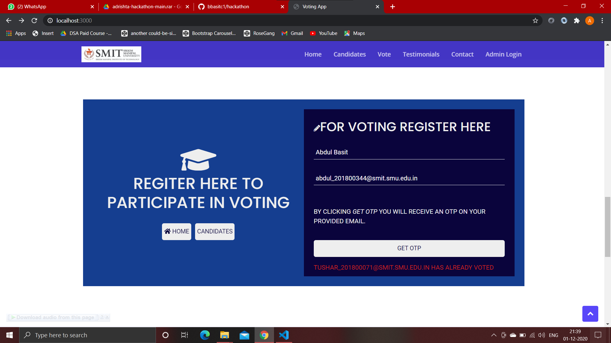
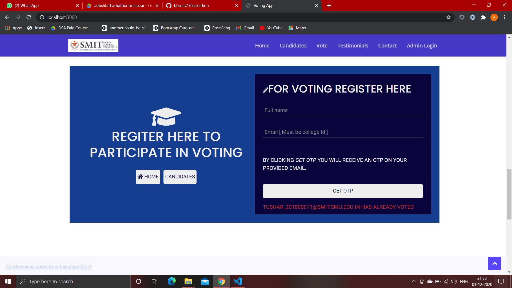

## Team Number 15 - \<I Voted>

### Project Overview

A brief description of 
* We tried to implement a secure online voting system so that elections of College VP can take place.

* What is the proposed solution?

### 1. To use college email ID as a Voter Card
### 2. Send OTP to mail id and verify the same 
### 3. Only vote can be casted through one email ID
### 4. Only mail ID provided by the college can be used to cast your vote. 

#### Technical Description

An overview of:
* HandleBars templates for Front-End

* Setup/Installations required to run the solution
    ### npm i express mongoose body-parser express-handlebars nodemailer
    ### npm i -D nodemon (Dev Dependency)

* Instructions to run the submitted code
    ### npm run start
### Screenshots
    
    
    
    
    
    
    
    
    
    
    

### Team Members
List of team member names and email IDs with their contributions.
|Member Name|Email|Contribution|
|-----------|-----|------------|
|Abdul Basit|basit.c1@gmail.com|Back-end|
|Tushar Nayan|tusharnayan2610@gmail.com|Fornt-end|

### References
[Stack Overflow](https://www.stackoverflow.com)
[Github](https://www.github.com)

